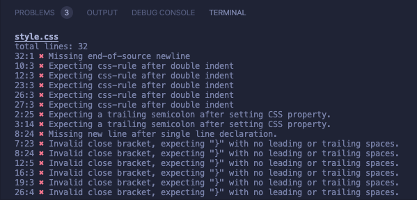

# Microverse Ruby Capstone | CSS Linter

> A simple CSS Linter built with Ruby.



A CSS linter that checks for the following errors

- Checks for trailing semi-colon after setting a CSS property.
- Checks for missing end-of-source newline.
- Checks if double indentation is followed by a valid CSS rule.
- Checks for newline and no leading or trailing spaces surrounding closing curly bracket.
- Checks for newline after single line declaration.
- Checks if single line declaration has only 1 declaration.

## Good vs. Bad Code Examples

### <ins>Trailing semi-colon after setting a CSS property</ins>

\# Good example

There's a semi-colon after the css property is set.
```css
.container {
  color: blue; 
}
```

\# Bad example

Missing semi-colon.
```css
.container {
  color: blue 
}
```

### <ins>Missing EOS newline</ins>

\# Good example

```css
section {
  color: blue; 
} 
/* file ends here with final empty line */
```

\# Bad example

```css
section {
  color: blue; 
} /* file ends here without final empty line */
```

### <ins>Closing Brackets should be on their own</ins>

\# Good example

The closing bracket has no leading or trailing spaces.

```css
div {
  font-size: 12px; # double indent 
}
```

\# Bad example

The closing bracket has leading and trailing spaces.

```css
section {
  color: blue; 
   }   
```

### <ins>Missing newline after single line declaration</ins>

\# Good example

The closing bracket no leading spaces.

```css
div { font-size: 12px; }

.new-rule {
  color: #fff;
  font-size: 11px;
}
```

\# Bad example

The closing bracket has empty spaces after the closing bracket.

```css
div { font-size: 12px; }   |

.new-rule {
  color: #fff;
  font-size: 11px;
}
```

## Built With

- Ruby
- CSS
- [Rainbow](https://rubygems.org/gems/rainbow)

## Video Introduction

Click on the link below to watch a video introduction of this project

[Video Introduction](https://youtube.com)

## Online Demo Link

To try the linter online visit the link below, however cloning and running the project locally is recommended.

[Live Demo](https://livedemo.com) 

## Running the linter locally

To get a local copy up and running follow these simple example steps.

1. You need to have [Ruby](https://www.ruby-lang.org/en/) installed on your computer to run this project.
2. You should be able to run `terminal`, `command prompt`, `bash` or `Powershell` to open your command line.
3. Run `git clone https://github.com/m15e/ruby-capstone-linter` to clone this repository to your local machine.
4. Run `cd ruby-capstone-linter` to go to the project folder.
5. Drag the css file(s) you would like the linter to inspect into the projects folder, the linter will scan and check all files ending with `.css`.
6. Run `bin/main.rb` to start the linter and the flaws in your code will be revealed.
7. (Optional) If you don't want the linter to ignore specific files run `bin/main.rb ignore <filename.css>`. If you would like more than 1 file to be ignored add more filenames (separated by spaces) to the end of the command.

### Prerequisites

- Ruby
- Commandline, Terminal, Prompt, Bash or Powershell
- Rspec for testing
- [Rainbow Gem](https://github.com/sickill/rainbow) 

### Setup

1. Installing Rainbow

Run the command below in your project's root folder to install the rainbow gem, this gem is used to print the linter output in color.

~~~bash
$ gem install rainbow
~~~

[Click here for additional resources and information for installing Ruby gems](https://guides.rubygems.org/rubygems-basics/)

## Run Tests using [Rspec](https://rspec.info)

### Installing Rspec

1. Installing Rspec

~~~bash
$ gem install rspec
~~~

2. Running tests with Rspec

To run tests run the following code in the command line from the root directory.

~~~bash
$ rspec
~~~

## Authors

👤 **Mark Rode**

- Github: [@m15e](https://github.com/m15e)

## Show your support

Give a ⭐️ if you like this project!

## Acknowledgments

- Microverse
- Stylelint

## 📝 License

This project is [MIT](lic.url) licensed.